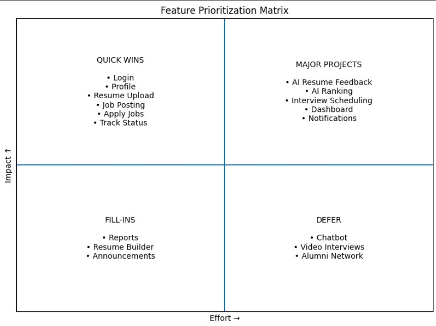

# Feature Prioritization
## AI-Powered Placement Management Platform

---

## 1. Framework — MoSCoW Method

We used the **MoSCoW Method** to prioritize features based on their importance to users and the platform's core purpose.

| Priority | Meaning |
|----------|---------|
| **Must Have** | Core features — platform cannot work without these |
| **Should Have** | Important features — not launch-blocking but high value |
| **Could Have** | Nice-to-have — adds value but can be built later |
| **Won't Have** | Out of scope for this release |

---

## 2. Feature Prioritization Table

| # | Feature | User Role | Priority | Reason |
|---|---------|-----------|----------|--------|
| 1 | User Registration & Login | All | Must Have | Entry point for all users; nothing works without this |
| 2 | Student Profile Creation | Student | Must Have | Core identity of every student on the platform |
| 3 | Resume Upload (PDF) | Student | Must Have | Central to the entire placement process |
| 4 | Job Posting by Recruiter | Recruiter | Must Have | No jobs = no placements; platform's core function |
| 5 | Job Application by Student | Student | Must Have | Primary action students take on the platform |
| 6 | Application Status Tracking | Student | Must Have | Students must know where they stand |
| 7 | View & Manage Applications | Recruiter | Must Have | Recruiters need to see who applied |
| 8 | Admin — User Management | Admin | Must Have | Admin must control who can access the platform |
| 9 | Candidate Shortlisting | Recruiter | Should Have | Key recruiter action but can be done manually initially |
| 10 | Email / In-App Notifications | All | Should Have | Important for timely updates but not a blocker |
| 11 | Interview Scheduling | Recruiter/Student | Should Have | Needed for full flow but complex to build |
| 12 | Job Search & Filters | Student | Should Have | Improves usability significantly |
| 13 | Admin Placement Dashboard | Admin | Should Have | Gives visibility but not needed for basic operation |
| 14 | Bulk Announcements by Admin | Admin | Should Have | Useful for drives and deadlines communication |
| 15 | AI Resume Feedback | Student | Could Have | Great differentiator but not core to placement flow |
| 16 | AI Candidate Ranking | Recruiter | Could Have | Adds intelligence but manual shortlisting works too |
| 17 | Export Reports (CSV/PDF) | Admin | Could Have | Helpful but not critical at launch |
| 18 | Resume Builder (in-platform) | Student | Could Have | Convenient but students can upload their own |
| 19 | Video Interview Integration | Recruiter | Won't Have | Too complex; interviews can happen outside platform |
| 20 | Chatbot for Student Queries | Student | Won't Have | High effort, low priority for v1 |
| 21 | Alumni Network Integration | Student | Won't Have | Out of scope for placement management |

---

## 3. Impact vs. Effort Matrix

The matrix plots each feature on two axes — **Impact** (vertical) and **Effort** (horizontal) — and divides them into four quadrants:

| Quadrant | Strategy | Features |
|----------|----------|---------|
| **Quick Wins** (High Impact, Low Effort) | Build first | Login, Profile, Resume Upload, Job Posting, Apply Jobs, Track Status |
| **Major Projects** (High Impact, High Effort) | Plan carefully | AI Resume Feedback, AI Ranking, Interview Scheduling, Dashboard, Notifications |
| **Fill-ins** (Low Impact, Low Effort) | Add when capacity allows | Reports, Resume Builder, Announcements |
| **Defer** (Low Impact, High Effort) | Won't Have — v2 roadmap | Chatbot, Video Interviews, Alumni Network |

---

## 4. Justification

**Must Have** — These 8 features form the complete basic flow: a student registers → uploads resume → applies to a job → tracks status. A recruiter posts a job → views applications. Admin manages users. Without any one of these, the platform does not function.

**Should Have** — Features like shortlisting, notifications, and interview scheduling make the platform complete, but the core flow still works without them at launch.

**Could Have** — AI features (resume feedback, candidate ranking) are the platform's differentiators but require more engineering effort. They are planned after the core is stable and tested.

**Won't Have** — Video interviews, chatbot, and alumni network are either too complex or outside the scope of a placement management tool for this release. They go on the v2 roadmap.

